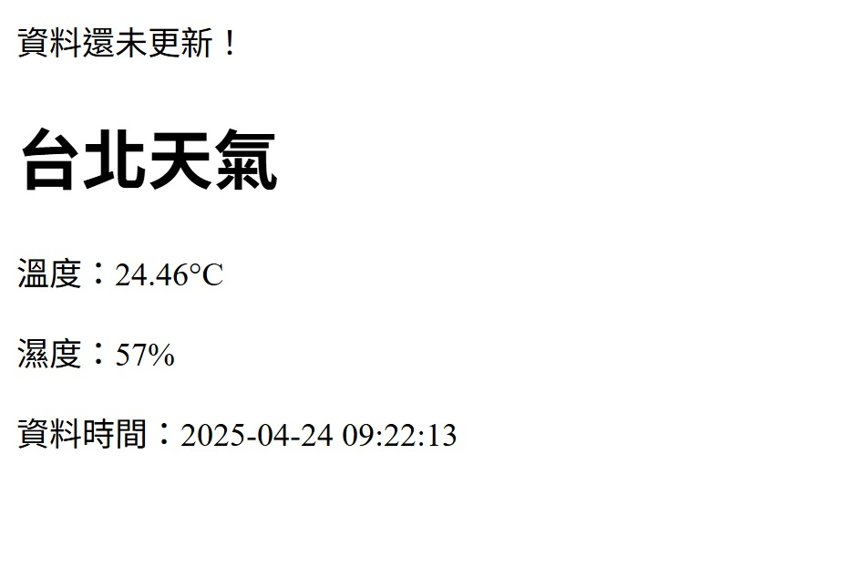
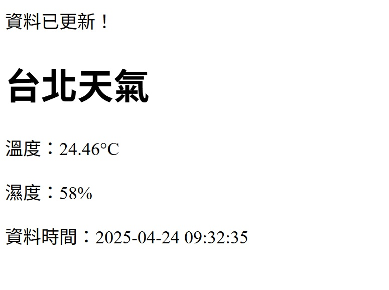

# 面試題目優化專案
## 專案概述
本專案為第一網站公司面試題目的優化版本，針對原始程式碼進行了多方面的改善。
## 改進重點
1. 設定時區(Asia/Taipei) 。
2. 資料是否更新的提示優化(只會出現有更新或不更新的提示)。
3. 資料時間更改為顯示api內的時間(dt),而非抓取資料當下的時間。
4. 簡化$data程式碼和提高可讀性。
5. xss防範。
## 參考圖
 

## 代碼
```php

<?php
// 設定時區
date_default_timezone_set('Asia/Taipei');
// 設定路徑
$filename ="./data/weather.json";
// 抓 API 並更新 JSON 檔案 
function updateWeather($filename) {
    include_once "./key.php";
    $url = $key;
    $response = file_get_contents($url);
    file_put_contents($filename, $response);
}

// 檢查是否已有資料
if (file_exists($filename)) {
    $lastModified = filemtime($filename);
    $now = time();

    // 如果距離上次更新超過 5 分鐘（300 秒）
    if (($now - $lastModified) > 300) {
        updateWeather($filename);
        echo "資料已更新！";  // 顯示更新訊息
        echo "<br>";
    }else{
        // 沒超過300秒 不更新
        echo "資料還未更新！";
    }
} else {
    // 檔案不存在，第一次執行
    updateWeather($filename);
    echo "第一次執行，資料已更新！<br>";  // 顯示更新訊息
}
// 讀取資料並顯示
$data = json_decode(file_get_contents($filename), true);
$time=date('Y-m-d H:i:s', $data['dt']);
$data_main=$data['main'];
?>
```
```html
<!DOCTYPE html>
<html lang="zh-TW">
<head>
    <meta charset="UTF-8">
    <title>台北天氣</title>
</head>
<body>
    <h1>台北天氣</h1>
    <p>溫度：<?= htmlspecialchars($data_main['temp']) ?>°C</p>
    <p>濕度：<?= htmlspecialchars($data_main['humidity']) ?>%</p>
    <p>資料時間：<?= htmlspecialchars($time) ?></p>
</body>
</html>
```

