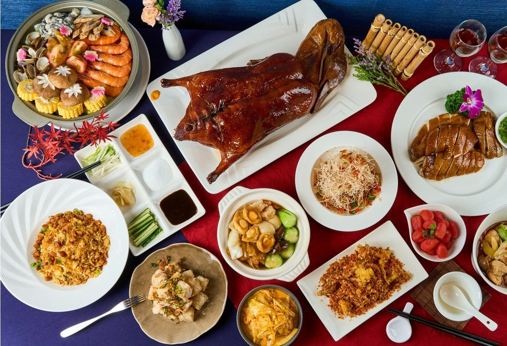
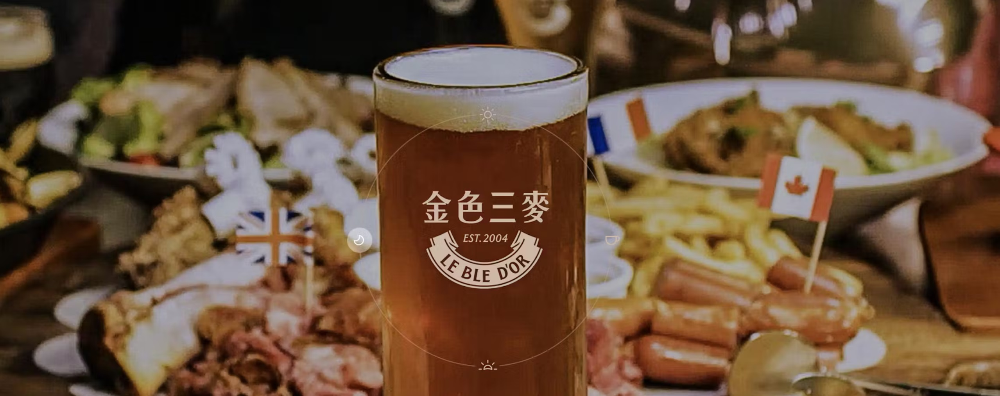
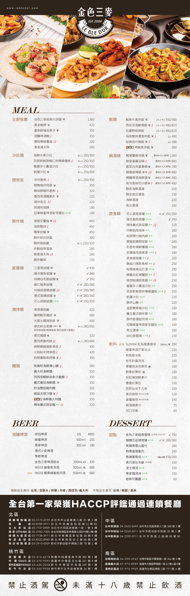
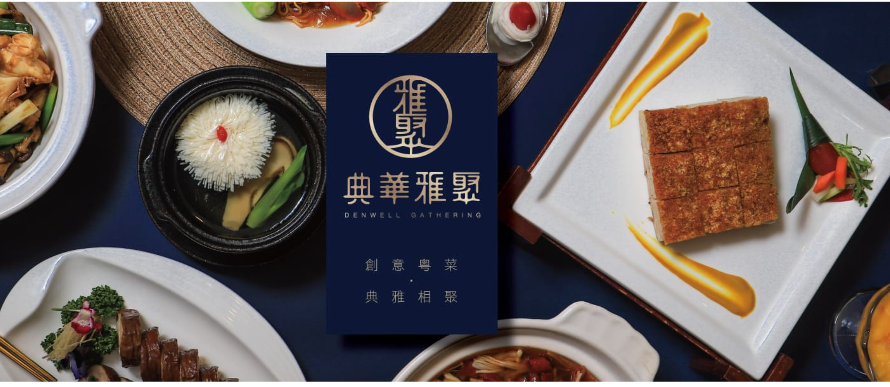
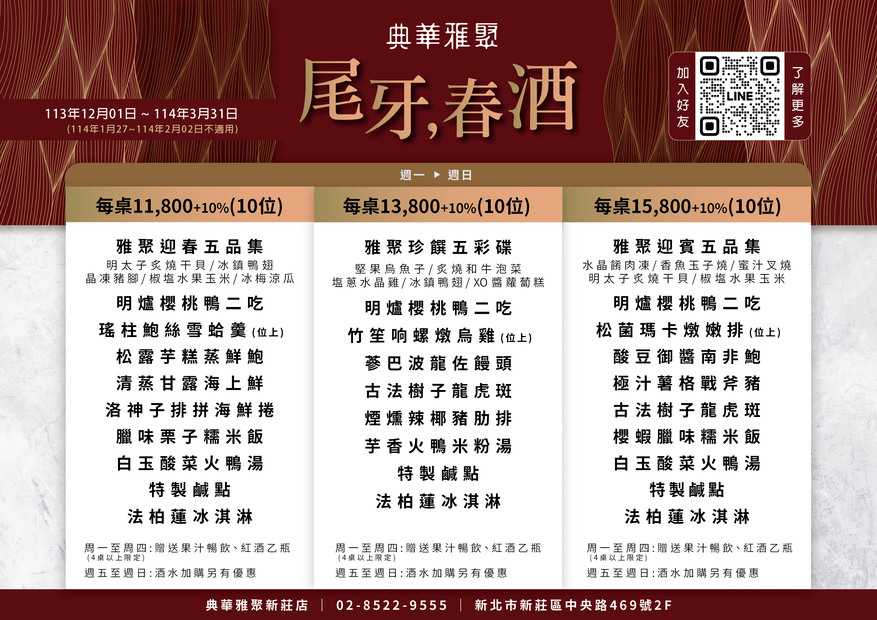

# 阿北私房菜｜餐酒館

###  [參考網站1](https://www.facebook.com/100071888693147/posts/367787495627537/)

-  電話　02 85216146

-  地址  242 新北市新莊區立信三街12巷2號  **(開車14分鐘)**

-  餐費:最低 680元/人 

![ !\[\[05.jpg\]\]](05.jpg)

![ !\[\[02.jpg\]\]](02.jpg)

![  !\[\[397261942_367787365627550_401116713339554088_n.jpg\]\]](397261942_367787365627550_401116713339554088_n.jpg)

# 拾山享中餐廳

### [參考網站1](https://www.hotel-intrendy.com/ballroom.php)

### [參考網站2](https://inline.app/booking/-NN08USXOD39rsKrXoxR:inline-live-3/-NN08Ue7keg3n2hx65KU)

-  電話　02 29015283

-  地址  243 新北市泰山區新北大道七段36號13F **(開車7分)**

-  餐費: 最低 990/1人

- PS: 尾牙後(約兩個禮拜)會再換菜單,但客服說喜歡現在的菜單也可請師傅準備
- 等於可再從中選擇一套喜歡的菜色

![-  !\[\[l_202304201423108680.jpg\]\]](l_202304201423108680.jpg)
![- !\[\[04.jpg\]\]](04.jpg)
![-  !\[\[01.jpg\]\]](01.jpg)

# 天賜良緣大飯店

### [參考網站1](https://tcly.com.tw/)

-  電話　02  29072345

-  地址  242  新北市新莊區中正路542號 **(開車7-8分)**

-  餐費:最低 880/人

![ !\[\[-LApVtMCRLqdRRGWE2ZE--LApVtMCRLqdRRGWE2ZF-504cdcf0-13ac-4fa3-bb45-756324eadc49.jpg\]\]](-LApVtMCRLqdRRGWE2ZE--LApVtMCRLqdRRGWE2ZF-504cdcf0-13ac-4fa3-bb45-756324eadc49.jpg)

# 金色三麥 新莊晶冠店

### [參考網站1](https://inline.app/booking/-KgvwgRUCRhdQfrVsuI3:inline-live-lebledor?language=zh-tw)
### [參考網站2](https://www.lebledor.com/location/jingguan)

-  電話　02 85228989

-  地址  242 新北市新莊區五工路66號 **(開車14分)**

-  餐費: 約 800 +-200 /人

- PS:有停車場汽車摩托車都方便 捷運站是機捷新北產業園區

# 典華雅聚 新莊店

### [參考網站1](https://gathering.tw/gathering.html)
### [參考網站2](https://inline.app/booking/-Lp1vF8VGUcoA8a-hKwT:inline-live-1/-M0zrgUa3kgKi2j1msGL?language=zh-tw)

-  電話　02 85229555

-  地址  242 新北市新莊區中央路469號 **(開車11-12分)**

-  餐費: 最低 1298元/人

